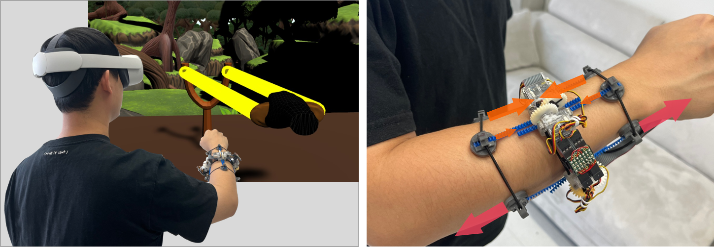

## QuadStretcher: A Forearm-Worn Skin Stretch Display for Bare-Hand Interaction in AR/VR (ACM CHI 2024)

    

-----------------

As the prevalence of bare-hand interaction rises in AR/VR environments, a crucial challenge emerges: How can we incorporate haptic feedback without encumbering the hands? **QuadStretcher** is a skin stretch display that delivers "substituted" haptic sensations on the forearm, facilitating immersive bare-hand AR/VR experiences. This work has been presented at [CHI 2024](https://chi2024.acm.org/), and more details about our work can be explored in: [Paper] (TBU) | [DOI] (TBU) | [Video] (TBU)

    
     
     A use case example: QuadStretcher rendering real-time haptic feedback of the pulled rubber band.

    
     
     Four bare-hand interaction scenarios in VR: <b>Archery (Gradual Tension), Pistol (Impact), Sprayer (Rapid Tension), and Pulling Rubber Band (3-DoF Resistance Force)</b>.

## What does this repository contain?

This repository provides materials for reproducing our work:
* QuadStretcher Hardware ([Open Hardware: How To Make](openHardware/README.md))
  * 3D models (.stl) of servo motor housing, pinion gear, tactor, and magnet clip
  * Specifications and links to the used products: rack gear, magnet
  * Step-by-step guideline to build the QuadStretcher.  
* QuadStretcher Unity
  * Unity version: 2021.3.16f1
  * Running with VR Headset via [Meta Quest Link](https://www.meta.com/help/quest/articles/headsets-and-accessories/oculus-link/set-up-link/)
  * Four Unity Scenes (Archery, Pistol, Sprayer, and Slingshot) are ready.
* Used VR Headset
  * [Meta Quest 2](https://www.meta.com/kr/quest/products/quest-2/)
  
