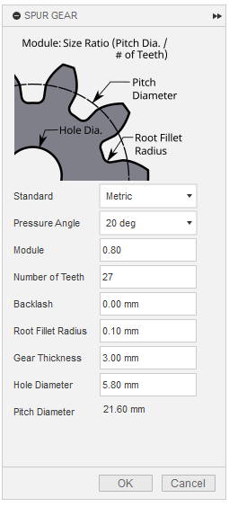
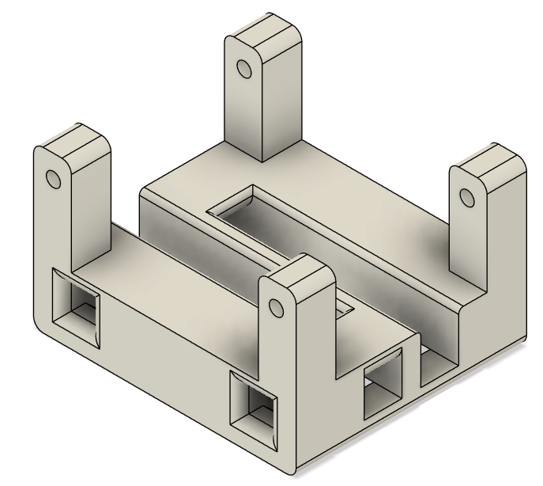

## Autodesk Fusion: 3D modeling step-by-step 

Archival of the 3D modeling process on Autodesk Fusion.

## Spur Gear

    

* On the top menu bar, Utilities - Add-INS - Scripts and Add-Ins
  

  
* On the bottom of the list, click SpurGear and Run
  

  
* Set options and click OK.
  
 Pressure Angle: 20 deg, Module: 0.80, Number of Teeth: 27, Backlash: 0.00 mm, Root Fillet Radius: 0.10 mm, Gear Thickness: 3.00 mm, Hole Diameter: 5.60 mm (Pitch Diameter: 21.60 mm)

* Extruding
  

  
  * Add a new sketch under the "Spur Gear" component in the hierarchy, (click activate component radio button on the right)
  * Draw the shapes using center rectangle and fillet on the four corners.
  * Extrude (depth: 1.50 mm)

## Servo Frame

    

* Please refer to the timeline history of the [servoFrameMaking.f3d](Autodesk_Fusion_Project_Files_(.f3d)/servoFrameMaking.f3d) for the modeling process.

## Tactor

    

* Please refer to the timeline history of the [tactorMaking.f3d](Autodesk_Fusion_Project_Files_(.f3d)/tactorMaking.f3d) for the modeling process (After printed, a silicon pad will be attached on the bottom).
